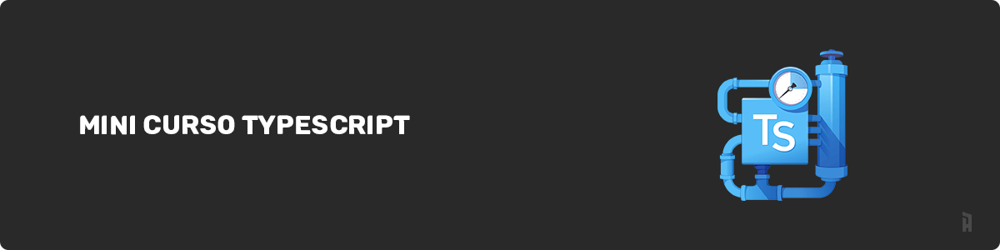

# 📮 Mini curso Typescript

[](https://github.com/iaurg)

Este repositório contém as minhas anotações e códigos apresentados no [mini curso de Typescript](https://www.youtube.com/watch?v=mRixno_uE2o&list=PLlAbYrWSYTiPanrzauGa7vMuve7_vnXG_) do Willian Justen para que possam ser consultados.

## O que é Typescript?

Superset de Javascript que permite utilizar tipagem estática ao Javascript. Escreve em Typescript e compila para Javascript.

## Porque usar?

Typescript visa evitar resultados inesperados pois tudo é acompanhado e processado em tempo de compilação.

Avisa se estiver fazendo coisas erradas no momento em que está escrevendo, pois acompanha as tipagens e regras definidas automaticamente (inferência) ou valores estipulados por você.

Funciona como uma espécie de documentação para seu código por acompanhar tudo que está sendo escrito.

A principal vantagem do Typescript é prevenir erros enquanto você desenvolve, ele alerta e informa o que deve ser feito em cada situação. Um Javascript que escala.

## Instalação do Typescript

A instalação do Typescript pode ser feita utilizando o comando:

```js
npm install -g typescript
```

Lembrando que é necessário ter [Node.js](https://nodejs.org/en/) instalado em sua máquina para conseguir executar o comando `npm`

Para estruturar regras como qual pasta compilar, como compilar, onde salvar e afins usa-se o arquivo .tsconfig, que pode ser iniciado/criado com `tsc --init` no root do projeto que deseja utilizar Typescript.

## Tipos do typescript

**String**: "oi", 'oi' e `oi`

**Number**: 1, 2.34, 0#ff0

**Boolean**: true, false

**Array**: Array<number> ou number[] - os dois dizem a mesma coisa, array de números.

**Tuple**: [number, string, string] - `[1, "foo", "Bar"]` - tupla é para quando você sabe o tamanho e tipos dos itens em sua array

**Enum**: enum `Colors { white = "#fff" }` - dá nome para valores basicamente

**any**: É qualquer (any) coisa, evite usar. Em poucos casos é utilizado para testar algo rapidamente antes de tipar.

**void**: vazio (void), retorna vazio

**null / undefined:** normalmente utilizado em conjunto com um tipo primário como `let city = string | undefined`

**never**: informar que algo nunca retornará nada

**object**: informa que é um objeto, podendo ter key:value com qualquer tipo

**unknown**: pode passar qualquer coisa, porém no momento em que definir o tipo ele irá alterar para o tipo definido

## Inferência de tipos

O Typescript identifica automaticamente valores de tipagens conhecidas ou que são percebidas de forma automática e infere esses tipos informando para você.

Inferência de tipos serve principalmente para que você não precise ficar tipando tudo, a grande maioria dos tipos são entendidos automaticamente pelo Typescript quando você declara um valor para uma variável.

```ts
const name: string = "iaurg";
const name = "iaurg";
/*Inferência, a variável aponta para uma string então o tipo inferido é string*/
```

Precisa tipar apenas informações que o Typescript não conhece ou que o desenvolvedor precisa saber.

## Type Alias e Union

É útil para facilitar a declaração de tipos quando são repetidos muitas vezes.

```ts
type Uid = number | string | undefined;
type Plataform = "Windows" | "Linux" | "Mac Os";
```

## Type Intersection e Interface extends

É possível "mesclar" tipagens para serem reaproveitadas em trechos de código utilizando intersection `&` em type ou `extends` em interface

## Interface

São conjuntos de dados para descrever e tipar a estrutura de um objeto.

Normalmente utilizado para representar objetos mais complexos, pode ser utilizados para implementar classes `implements`

## Types vs Interfaces

Comece utilizando types e caso precise extender use interfaces, types normalmente serão mais utilizados. Interfaces são bastante utilizadas com criação de bibliotecas ou na criação de objetos/classes (OPP).

Sempre preze pela consistência, se o seu código já existe com `types` ou `interface` mantenha o padrão, mas caso esteja iniciando um novo projeto preze por utilizar types e evoluir para interfaces conforme necessário.

## Generics

Reutilização de código, código mais genérico que aceita diversos tipos de entrada e argumentos em suas tipagens. É possivel com `generics` criar estruturas mais complexas e mutáveis com aceitação de diversos tipos em uma estrutura.

## Type Utilities

São utilizados para algumas transformações e modificações comuns que pode acontecer em seus tipos. Permite que você utilize um mesmo `type` / `interface` em diversas ocasiões moldando o que deseja utilizar deste tipo, por exemplo omitindo algo ou pegando apenas alguns valores.

## Decorators

Servem para anotar e interceptar ações dentro do código, marcando um ponto para executar outra tarefa.
